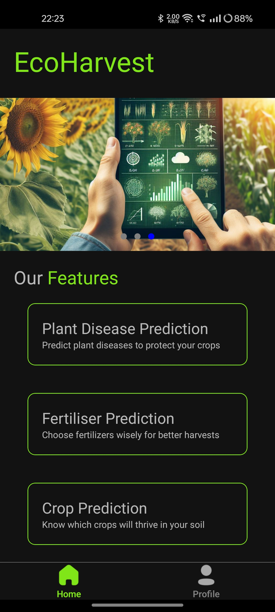
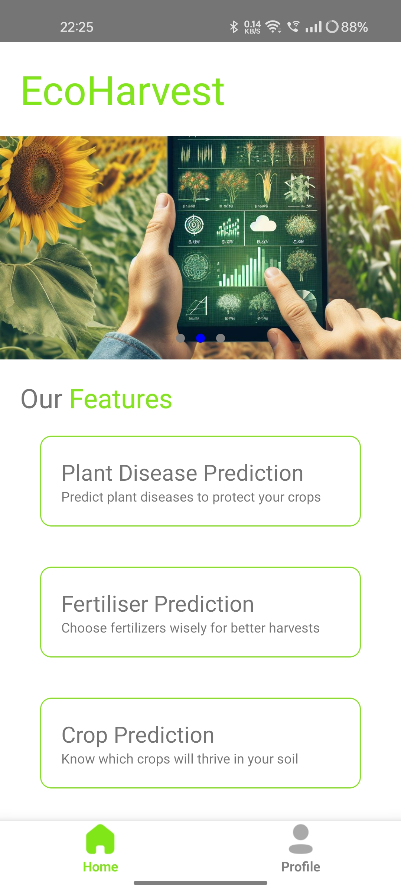
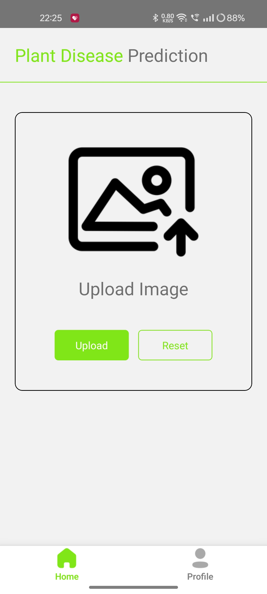
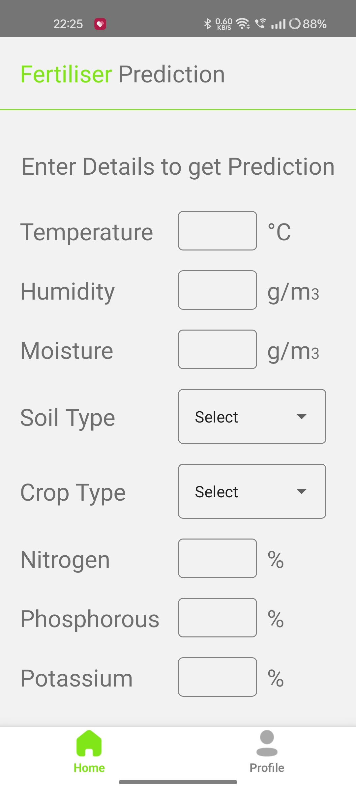

# EcoHarvest

> **EcoHarvest** is a cross-platform application designed to help farmers optimize agricultural practices by leveraging machine learning and real-time data.

---

## Table of Contents

1. [Introduction](#introduction)
2. [Features](#features)
3. [Technology Stack](#technology-stack)
4. [Installation](#installation)
5. [Usage](#usage)
6. [API Documentation](#api-documentation)
7. [Contributing](#contributing)
8. [License](#license)
9. [Contact](#contact)

---

## Introduction

**EcoHarvest** is a cross-platform application designed to help farmers optimize agricultural practices by leveraging machine learning and real-time data. The application provides several key features to improve crop management.

With **EcoHarvest**, farmers can make data-driven decisions, improving the efficiency and sustainability of their farming practices.

---

## Features

**EcoHarvest** offers a range of features designed to assist farmers in optimizing their agricultural practices:

- **Plant Disease Prediction**:

  - Utilizes machine learning algorithms to identify potential diseases in crops, enabling early intervention and reducing crop loss.

- **Fertilizer Prediction**:

  - Analyzes soil conditions and crop types to recommend the most effective fertilizers, improving soil health and crop yield.

- **Crop Prediction**:

  - Leverages historical data and current agricultural trends to guide farmers in selecting crops that are most likely to thrive in their environment.

- **Yield Prediction**:
  - Provides estimates of crop yields based on various factors, helping farmers plan their resources and maximize productivity.

---

## Technology Stack

<!-- Add the technology stack here -->

## Technology Stack

**EcoHarvest** is built using a combination of modern technologies to provide a robust and scalable solution:

### Frontend:

- **React Native**: For developing a cross-platform mobile application.
- **Redux**: For state management within the application.
- **Tailwind CSS**: For styling the user interface with a utility-first CSS framework.

### Backend:

- **Node.js**: A JavaScript runtime for building scalable server-side applications.
- **Express.js**: A web framework for building RESTful APIs in Node.js.
- **MongoDB**: A NoSQL database for storing user and agricultural data.
- **Mongoose**: An ODM (Object Data Modeling) library for MongoDB, providing schema validation and other features.

### Machine Learning:

- **Python**: For building the machine learning models used in predictions.
- **Scikit-learn**: A library for machine learning in Python used for implementing various predictive algorithms.

### Other Technologies:

- **Docker**: For containerizing the application components, ensuring consistency across different environments.

---

## Installation

## Installation

To set up the **EcoHarvest** project locally, follow these steps:

### Prerequisites

- **Node.js**: Ensure that you have Node.js installed (version 14 or above).
- **MongoDB**: Set up a MongoDB database (either locally or using a cloud service like MongoDB Atlas).
- **Python**: Ensure that you have Python installed (version 3.6 or above) for the machine learning backend.
- **Docker**: Install Docker to run containerized services (optional, but recommended).

### Steps

1. **Clone the repository:**

   ```bash
    git clone https://github.com/your-username/eco-harvest.git
    cd eco-harvest
   ```

2. **Install backend dependencies for Server 1 (Node.js):**

   ````bash
    cd Server_1
   npm install
   ````

3. **Install dependencies for Server 2 (Python ML Server):**

   ```bash
   cd Server_2
   pip install -r requirements.txt
   ```

4. **Install frontend dependencies (React Native app):**
   ```bash
    cd ../App
    npm install
   ```

5. **Set up environment variables for the Node.js server in a ```.env``` file:**
   ```bash
    MONGO_URI=<your-mongodb-uri>
    JWT_SECRET=<your-jwt-secret>
    ```

6. **Run the Node.js backend server:**
    ```bash
    cd Server_1
    npm start
    ```

7. **Run the Machine Learning server (if applicable):**
    ```bash
    cd Server_2
    python app.py
    ```

8. **Run the React Native app(requires android studio/ use ```.apk``` from server_1/resources):**
    ```bash
    cd ../App
    npm run android
    ```
---
## Screenshots

Here are some screenshots of the **EcoHarvest** application:

### Home Screen (Dark Mode)


### Home Screen (Light Mode)


### Plant Disease Prediction


### Fertiliser Prediction


---
## Contact
Nilesh Deshpande
    nileshdeshpandework@gmail.com
